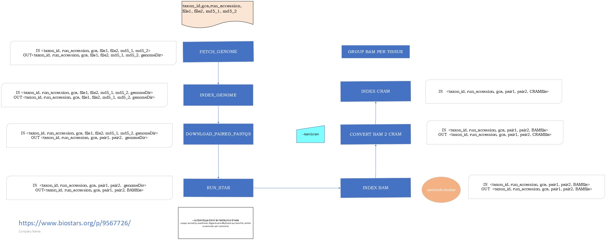

# Genebuild Transcriptomic pipeline

This pipeline processes transcriptomic data for various taxon IDs, performing a series of steps to fetch data, perform quality checks, subsample files, run alignments, and store the results of each step in a database. The pipeline is designed for scalability and reproducibility using Nextflow.



## Steps in the Pipeline:

1. **Fetch Run Accessions from ENA**: For each taxon ID, retrieve the list of run accessions from the ENA archive since January 1, 2019, or from the last check.

2. **Fetch Metadata and Perform Quality Checks**: For each run accession, get metadata from ENA and conduct quality checks using FASTQC, then store the results into the database.

3. **Subsample FASTQ Files**: Subsample the paired FASTQ files to reduce their size.

4. **Run STAR Alignment**: Align the subsampled FASTQ files to the provided genome assembly using the STAR aligner, then store the results into the database.

## Batching

The batching option is available to process species with a huge amount of rnaseq data. The batches can be created via src/python/ensembl/genes/metadata/transcriptomic/check_for_transcriptomic_batch.py : give a taxon id and the batch size the script retrieves the list of run accession and split them in multiple txt files according to the batch size. 
The pipeline considers the date of the last processed date as last cheked date for future updates.

### Mandatory arguments

#### `--csvFile`
The structure of the file can cahnge according to the running options
| csv file format |
|-----------------|
| taxon_id,gca (header)   | 
| <taxon_id>,<gca>        |

In case of batching
| csv file format |
|-----------------|
| taxon_id,gca,runs_file (header)           | 
| <taxon_id>,<gca>,<path to the batch file> |


#### `--outDir`
Path to the directory where to store the results of the pipeline

#### `transcriptomic_dbname`
The name of the transcriptomic db.

#### `--transcriptomic_dbhost`
The host name for the database 

#### `--transcriptomic_dbport`
The port number of the host 

#### `--transcriptomic_dbuser`
The read/wrote username for the host (admin user). 

#### `--transcriptomic_dbpassword`
The database password. 

#### `--user_r`
The read only username for the host. 


```bash
nextflow -C $ENSCODE/ensembl-genes-metadata/nextflow.config run $ENSCODE/ensembl-genes-metadata/pipelines/nextflow/workflows/short_read.nf -entry SHORT_READ  --csvFile <csv_file_path> --outDir <output_dir_path> --transcriptomic_dbname <db name> --transcriptomic_dbhost <mysql_host> --transcriptomic_dbport <mysql_port> --transcriptomic_dbuser <user> --user_r <read_user>  --transcriptomic_dbpassword <mysql_password> -profile slurm
```


### Optional arguments


#### `--cacheDir`
Path to the directory to use as cache for the intermediate files. If not provided, the value passed to `--outDir` will be used as root, i.e. `<outDir>/cache`.

#### `--files_latency`
Sleep time (in seconds) after the genome and proteins have been fetched. Needed by several file systems due to their internal latency. By default, 60 seconds.

#### `--cleanOutputDir`
Clean outDir, default False.

#### `--backupDB`
Backup database using day and time id, default True.

### Pipeline configuration

#### Using the provided nextflow.config
We are using profiles to be able to run the pipeline on different HPC clusters. The default is `standard`.

* `standard`: uses LSF to run the compute heavy jobs. It expects the usage of `scratch` to use a low latency filesystem.
* `slurm`: uses SLURM to run the compute heavy jobs. It expects the usage of `scratch` to use a low latency filesystem.


#### Using a local configuration file
You can use a local config with `-c` to finely configure your pipeline. All parameters can be configured, we recommend setting these ones as well:

* `process.scratch`: The patch to the scratch directory to use
* `workDir`: The directory where nextflow stores any file

### Information about all the parameters

```bash
nextflow run ./ensembl-genes-metadata/pipelines/nextflow/workflows/short_read.nf --help
```


#### Docker dependencies
These are software required by this pipeline and downloaded as Singularities:

| Software  | Docker image |  
|-----------------|--------|
| python  | python:3.9.19 |
| [FastQC](https://github.com/s-andrews/FastQC/tree/master)  | staphb/fastqc:latest |
| [seqtk](https://github.com/lh3/seqtk)  | nanozoo/seqtk:latest |
| [STAR](https://github.com/alexdobin/STAR)  | ebileanne/star:latest |


Remember that, following the instructions in [Ensembl's Perl API installation](http://www.ensembl.org/info/docs/api/api_installation.html), you will also need to have BioPerl v1.6.924 available in your system. If you do not, you can install it executing the following commands:

```bash
wget https://github.com/bioperl/bioperl-live/archive/release-1-6-924.zip
unzip release-1-6-924.zip
mv bioperl-live-release-1-6-924 bioperl-1.6.924
```

It is recommended to install it in the same folder as the Ensembl repositories.
