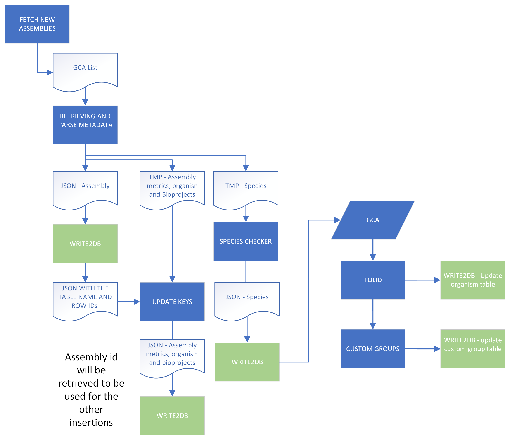

# Genebuild assembly metadata pipeline

The pipeline connects to the NCBI API to retrieve the latest eukaryotic genome assemblies and efficiently manages the associated metadata. The data is stored in a MySQL database on the GB1 server, specifically for assembly metadata. The pipeline primarily sources data from the NCBI API, downloading and processing relevant information through a series of Python scripts. Additional data is gathered from both the NCBI Taxonomy API and the [DTOL API](https://id.tol.sanger.ac.uk) to complement the assembly metadata.



The repository provides a NextFlow configuration file, which specify the input variables (mandatory and default) and two execution profiles: slurm and lsf

This pipeline has been tested in the new modular environment and with the latest Nextflow version (version 24.04.3) available in Codon 

For more information about the mysql DB check out this [documentation](https://www.ebi.ac.uk/seqdb/confluence/pages/resumedraft.action?draftId=217010361&draftShareId=89535c0f-563f-4bf4-bf85-f047557aed6f&)

# Requirements 

## Ensembl dependencies 

It is recommended that all the repositories are cloned into the same folder. 

| Repository name | branch | url |
|-------------------|-------|----|
| ensembl-genes | main | https://github.com/Ensembl/ensembl-genes.git |

# Running options

## Mandatory

- `--output_dir`: path to the directory where to store the results of the pipeline
- `--enscode`: environmental enscode variable   
- `-profile`: specify which execution profile use (slurm or lsf) 

## Default variables
- `--taxon`: taxonomy ID. Default value is 2759
- `--ncbi_url`: current URL to access 
- `--ncbi_params`: path to NCBI API params (file in data folder)
- `--db_table_conf`: path to db table configuration (file in data folder)
- `--metadata_params`: path to assembly metadata db credentials (file in data folder)
- `--registry_params` : path to assembly registry db credentials (file in data folder)

# Using the pipeline

**Getting help**
```bash
nextflow run ${ENSCODE}/ensembl-genes-metadata/pipeline/assembly_pipeline.nf --help
```

**Executing pipeline**
```bash
nextflow -C ${ENSCODE}/ensembl-genes-metadata/conf/assembly_pipeline.conf \
run ${ENSCODE}/ensembl-genes-metadata/pipeline/assembly_pipeline.nf \
--output_dir /path/to/output/dir/ \
--enscode ${ENSCODE} -profile slurm
```

# Standalone modules


