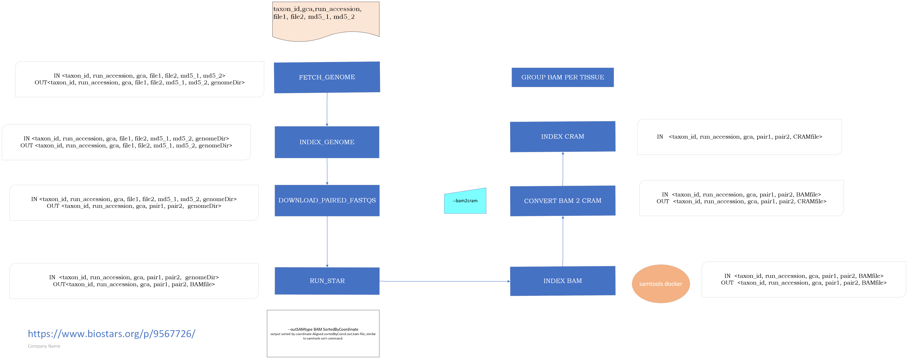

# Genebuild Transcriptomic pipeline

This pipeline processes transcriptomic data for various taxon IDs, performing a series of steps to fetch genome file, run alignments, and convert the BAM into CRAM format. The pipeline is designed for scalability and reproducibility using Nextflow.



## Steps in the Pipeline:

1. **Fetch and index genome file**: For each taxon ID, download and index the genome file from NCBI dataset.

2. **Run STAR Alignment**: Align  FASTQ files to the provided genome assembly using the STAR aligner.

3. **Convert BAM file to CRAM**: Convert BAm file to CRAM format when bam2cram is true.


### Mandatory arguments

#### `--csvFile`
The structure of the file can cahnge according to the running options
| csv file format |
|-----------------|
| taxon_id,gca,run_accession,pair1,pair2,md5_1,md5_2 (header)   | 
| <taxon_id> , <gca> , <run_accession> , <pair1> , <pair2> , <md5_1> , <md5_2>        |


#### `--outDir`
Path to the directory where to store the results of the pipeline


```bash
nextflow -C $ENSCODE/ensembl-genes-metadata/nextflow_star.config run $ENSCODE/ensembl-genes-metadata/pipelines/nextflow/workflows/star_alignment.nf -entry STAR_ALIGNMENT  --csvFile <csv_file_path> --outDir <output_dir_path>  -profile slurm
```

### Optional arguments

####  `--bam2cram`  
Option to convert BAM file to CRAM format, default true.

#### `--cacheDir`
Path to the directory to use as cache for the intermediate files. If not provided, the value passed to `--outDir` will be used as root, i.e. `<outDir>/cache`.

#### `--files_latency`
Sleep time (in seconds) after the genome and proteins have been fetched. Needed by several file systems due to their internal latency. By default, 60 seconds.

#### `--cleanOutputDir`
Clean outDir, default False.


### Pipeline configuration

#### Using the provided nextflow_star.config
We are using profiles to be able to run the pipeline on different HPC clusters. The default is `standard`.

* `standard`: uses LSF to run the compute heavy jobs. It expects the usage of `scratch` to use a low latency filesystem.
* `slurm`: uses SLURM to run the compute heavy jobs. It expects the usage of `scratch` to use a low latency filesystem.


#### Using a local configuration file
You can use a local config with `-c` to finely configure your pipeline. All parameters can be configured, we recommend setting these ones as well:

* `process.scratch`: The patch to the scratch directory to use
* `workDir`: The directory where nextflow stores any file

### Information about all the parameters

```bash
nextflow run ./ensembl-genes-metadata/pipelines/nextflow/workflows/star_alignment.nf --help
```


#### Docker dependencies
These are software required by this pipeline and downloaded as Singularities:

| Software  | Docker image |  
|-----------------|--------|
| python  | python:3.9.19 |
| [FastQC](https://github.com/s-andrews/FastQC/tree/master)  | staphb/fastqc:latest |
| [seqtk](https://github.com/lh3/seqtk)  | nanozoo/seqtk:latest |
| [STAR](https://github.com/alexdobin/STAR)  | ebileanne/star:latest |


Remember that, following the instructions in [Ensembl's Perl API installation](http://www.ensembl.org/info/docs/api/api_installation.html), you will also need to have BioPerl v1.6.924 available in your system. If you do not, you can install it executing the following commands:

```bash
wget https://github.com/bioperl/bioperl-live/archive/release-1-6-924.zip
unzip release-1-6-924.zip
mv bioperl-live-release-1-6-924 bioperl-1.6.924
```

It is recommended to install it in the same folder as the Ensembl repositories.
