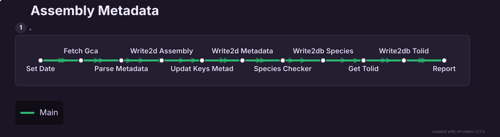

# Assembly Metadata

Registers new eukaryotic genome assemblies into the Genebuild assembly
metadata database. For each new GCA accession, the pipeline retrieves
assembly metadata from the [NCBI Datasets
API](https://www.ncbi.nlm.nih.gov/datasets/), species and taxonomy
information from the NCBI Taxonomy API, and Tree of Life IDs from the
[Darwin Tree of Life API](https://id.tol.sanger.ac.uk), then writes the
resulting records to the database.

## Requirements

- [Nextflow](https://www.nextflow.io/) >= 24.04.03
- Singularity >= 3.7.0
- Access to a SLURM cluster
- Access to the Genebuild assembly metadata MySQL database

## Pipeline flow

For each GCA accession, in order:

1. **`SET_DATE`** — determines the date threshold for fetching new assemblies (from the database, a custom date, or a full scan since 2019)
2. **`FETCH_GCA`** — fetches GCA accessions from NCBI (or a user-provided list) and filters out already-registered assemblies
3. **`PARSE_METADATA`** — retrieves and parses assembly metadata from the NCBI Datasets API
4. **`WRITE2DB`** — writes the assembly record to the `assembly` table
5. **`UPDATE_KEYS_METADATA`** — updates foreign keys in the metadata JSON using the newly assigned database IDs
6. **`WRITE2DB`** — writes extended metadata (metrics, bioprojects, taxonomy)
7. **`SPECIES_CHECKER`** — validates and enriches species information via the NCBI Taxonomy API
8. **`WRITE2DB`** — writes species and organism records
9. **`GET_TOLID`** — queries the Darwin Tree of Life API for the assembly's ToL ID
10. **`WRITE2DB`** — writes the ToL ID record
11. **`REPORT`** — generates a summary report and a CSV shortlist for downstream BUSCO analyses

`WRITE2DB` is one module invoked several times under different aliases — see
[Modules](modules/index.md) for what each module does on its own, and
[Workflows](workflows/index.md) for how they're wired together.

## See also

- [Parameters](parameters.md) for every `--option` the pipeline accepts
- [Input](input.md) and [Output](output.md) for what goes in and what comes out
- [Troubleshooting](troubleshooting.md)
