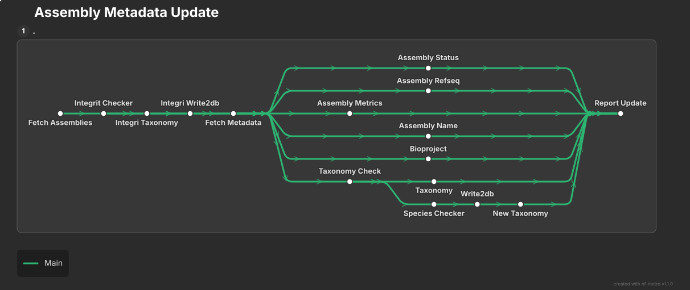

# Assembly Metadata Update

Checks the integrity of existing assembly records in the Ensembl assembly
metadata database and reconciles their metadata against NCBI. It flags
corrupted records and missing taxonomy information, compares assembly
status, RefSeq accession, metrics, name, BioProject and taxon ID against
the [NCBI Datasets API](https://www.ncbi.nlm.nih.gov/datasets/), updates
the database in place when a difference is found, and can notify
genebuilders of changes via Slack.

## Requirements

- [Nextflow](https://www.nextflow.io/) >= 24.04.03
- Singularity >= 3.7.0
- Access to a SLURM cluster
- Access to the Ensembl assembly metadata MySQL database
- A Slack bot token and app, if using `--slack_report`

## Pipeline flow

The pipeline runs in two phases for every GCA accession.

### Phase 1 — Integrity check

1. **`FETCH_ASSEMBLIES`** — builds the list of GCAs to check, either from a user-provided list or from the database (high-priority assemblies released after `--screen_date`)
2. **`INTEGRITY_CHECKER`** — checks that the expected rows exist across `assembly_metrics`, `organism`, `bioproject`, `taxonomy`, `species` and `taxonomy_name`, classifying each accession as `correct`, `taxonomy_update`, `delete` or `check`
3. **`INTEGRITY_TAXONOMY`** — for `taxonomy_update` accessions, fetches the NCBI taxonomy lineage
4. **`WRITE2DB`** — backfills the missing `taxonomy`/`taxonomy_name` rows

Accessions classified `delete` (missing records, no active genebuild annotation)
are removed from the database and listed in `deleted_GCAS_to_add.csv`.
Accessions classified `check` (missing records, but an active annotation
exists) are listed in `to_manually_check_GCAS.csv` for manual review and
are not processed further.

### Phase 2 — Metadata comparison and update

5. **`FETCH_METADATA`** — retrieves the latest assembly report from the NCBI Datasets API
6. **`ASSEMBLY_STATUS`**, **`ASSEMBLY_REFSEQ`**, **`ASSEMBLY_METRICS`**, **`ASSEMBLY_NAME`**, **`BIOPROJECT`** — compare each field against the database in parallel, updating it in place on a mismatch
7. **`TAXONOMY_CHECK`** — compares the taxon ID against NCBI
8. **`TAXONOMY`** — updates taxon ID, scientific name and common name directly when the taxon is already known
9. **`SPECIES_CHECKER`** / **`WRITE2DB`** / **`TAXONOMY`** (as `NEW_TAXONOMY`) — registers a taxon ID that isn't yet in the registry
10. **`REPORT_UPDATE`** — when `--slack_report` is set, sends a Slack DM to the genebuilder assigned to the assembly

Each comparison step emits a row (`accession, check_type, reporting,
previous_value, new_value`) used to build `report_track.csv`. See
[Modules](modules/index.md) for what each module does on its own, and
[Workflows](workflows/index.md) for how they're wired together.

## See also

- [Parameters](parameters.md) for every `--option` the pipeline accepts
- [Input](input.md) and [Output](output.md) for what goes in and what comes out
- [Troubleshooting](troubleshooting.md)
